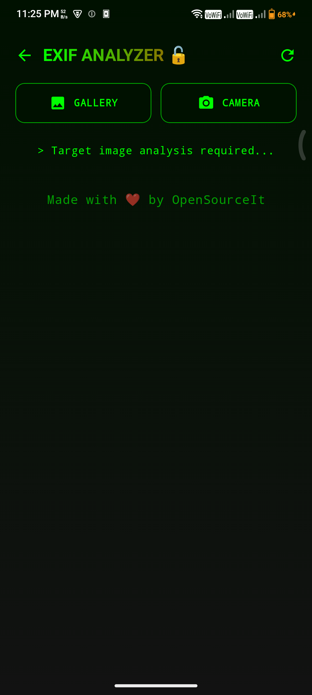
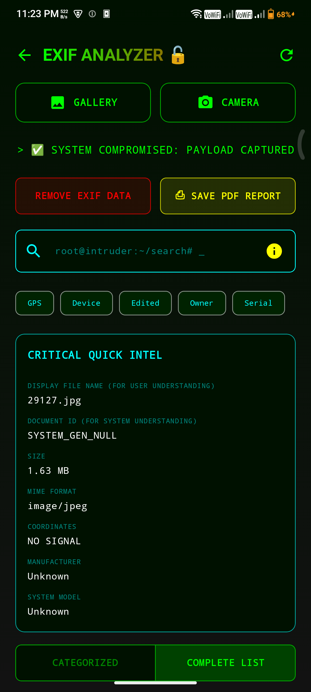
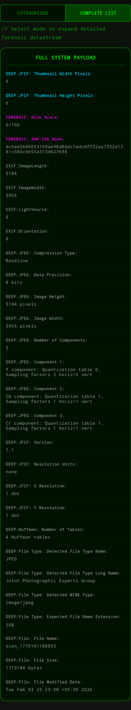
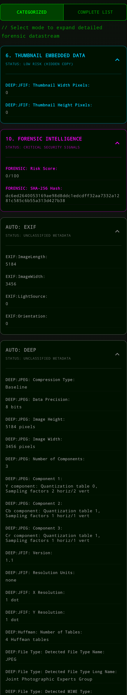

  

<h1 align="center">
🛡️ EXIFER 🛡️
</h1>

<code style="color:#00ffcc;">
[ GPS • DEVICE • OWNER • PAYLOAD • HASH ]
</code>

Exifer is a next-generation **cybersecurity-focused EXIF and metadata forensic analyzer** for Android.

It is designed to help users, investigators, journalists, and privacy-aware individuals detect:

- Hidden metadata leaks
- Location exposure (GPS stalking risk)
- Device fingerprinting identifiers
- Editing/tampering traces
- Embedded payload signatures (ZIP/PDF/DEX/ELF)
- Integrity hashes (SHA-256)
- High entropy steganography suspicion

---

## 📸 Screenshots

<table align="center">
  <tr>
    <td align="center">
      <b>1. Home Screen</b> 
      
    </td>
    <td align="center">
      <b>2. Quick Details</b> 
      
    </td>
  </tr>
  <tr>
    <td align="center">
      <b>3. Full Exif Detail</b> 
      
    </td>
    <td align="center">
      <b>4. Categorized Exif Detail</b> 
      
    </td>
  </tr>
</table>

---

## 🚀 Key Features

### ✅ Complete Metadata Extraction
- Full Android EXIF tag sweep
- MakerNote extraction (Canon, Nikon, Sony, Olympus, Panasonic, Fujifilm)
- Deep metadata parsing (XMP, IPTC, ICC Profiles)

### 🛰 GPS & Privacy Leak Detection
- Decimal coordinate extraction
- Location exposure risk classification

### 🔥 Cybersecurity Intelligence Layer
- Metadata Risk Score (0–100)
- Tampering detection (Photoshop/Snapseed/Lightroom traces)
- SHA-256 file fingerprinting

### 🧹 EXIF Removal / Sanitization
- One-tap metadata stripping via bitmap re-encoding
- Outputs clean image to Downloads

### 📄 PDF Forensic Report Export
- Generate a full metadata intelligence report
- Saved automatically in Downloads/Exif_Data_Reports

### 🖥 Hacker-Style UI Console
- Categorized forensic breakdown
- Full datastream mode
- Smart search with synonyms + fuzzy matching
- Quick Intel summary panel

---

## 🛠 Tech Stack

- **Kotlin + Jetpack Compose**
- AndroidX ExifInterface
- Drew Noakes Metadata Extractor
- iText PDF Export Engine

---

## 🔍 Forensic Categories Included

- GPS / Location Intelligence
- Device Identification & Fingerprinting
- Date & Timeline Reconstruction
- Software / Editing History
- Owner & Identity Leakage
- Embedded Thumbnail Traces
- Unique File Identifiers
- Network / Source Metadata
- Camera Forensic Settings
- Forensic Intelligence

---

## 📌 Transparency & AI Attribution

This project is **fully open source** and built with transparency.

### AI Tools Used During Development
- **Google Gemini Pro**
- **OpenAI GPT GO**

### Human Design & Prompt Direction
While AI contributed to implementation support, the **UI concept, design direction, and feature vision were provided by the human prompter/developer**.

---

## ⚖ Disclaimer
Exifer is provided for privacy awareness and forensic education. This tool is **not intended for illegal surveillance or misuse**.

---

## 📜 License (CC BY-NC 4.0)
This project is free for community use and modification, but **strictly non-commercial**. You are not allowed to sell this project or its forks.
